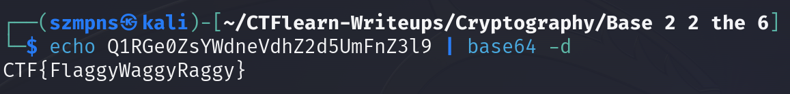

# Base 2 2 the 6       

Author says:

There are so many different ways of encoding and decoding information nowadays... One of them will work! `Q1RGe0ZsYWdneVdhZ2d5UmFnZ3l9`.

### Step-1: Base64



### Step-2: Paste The Flag

```
CTF{FlaggyWaggyRaggy} 
```