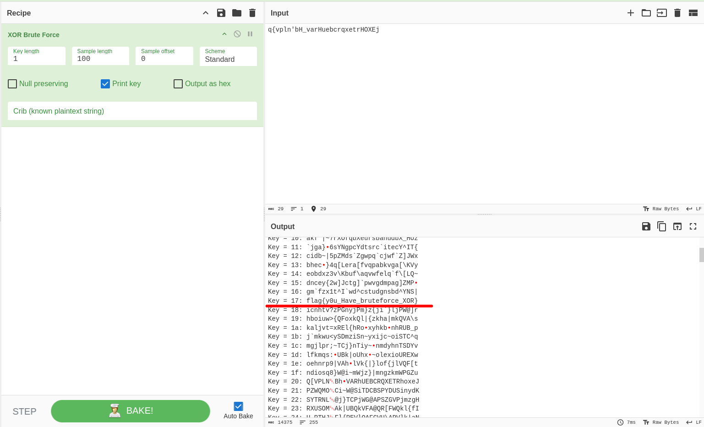

# BruXOR      

XOR (Exclusive OR) is a logical operation that outputs true only when the inputs differ. It is commonly used in cryptography for simple encryption and data integrity checks due to its properties of reversibility and bitwise manipulation.

### Step-1: Cyberchef

Use `cyberchef` with `XOR Brute Force` mode.



### Step-2: Paste The Flag

```
flag{y0u_Have_bruteforce_XOR}
```