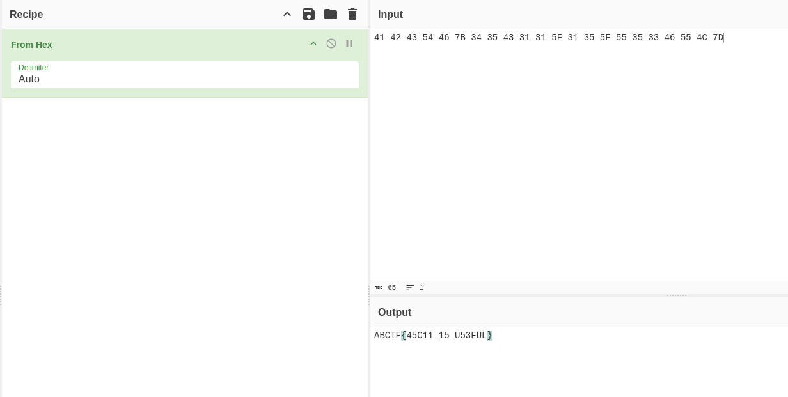

# Character Encoding         

Hexadecimal, also known as hex, is a base-16 number system used in mathematics and computer science. It uses sixteen symbols, 0-9 and A-F, to represent values, making it efficient for encoding binary data and simplifying the representation of large numbers.

### Step-1: Cyberchef

Use `From Hex`.



### Step-2: Paste The Flag

```
ABCTF{45C11_15_U53FUL}
```