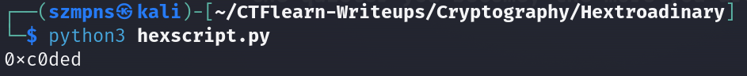

# Hextroadinary

Author says:

Meet ROXy, a coder obsessed with being exclusively the worlds best hacker. She specializes in short cryptic hard to decipher secret codes. The below hex values for example, she did something with them to generate a secret code, can you figure out what? Your answer should start with 0x.

0xc4115 0x4cf8

It gives us straight information that we gotta XOR given Hex numbers.

### Step-1: Simple Python script

I wrote simple script:

```
text = hex(0xc4115 ^ 0x4cf8)

print(text)
```
Feel free to use it.



### Step-2: Paste The Flag

```
0xc0ded
```