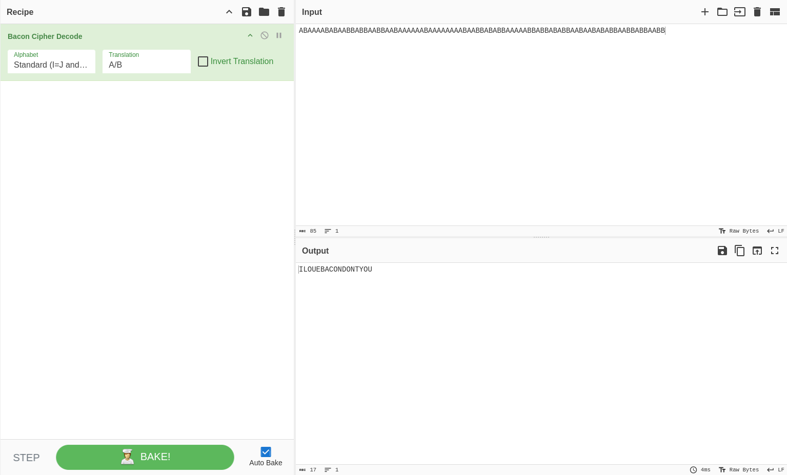

# HyperStream Test #2       

The Bacon cipher is a cipher in which the encrypted text contains five-letter sequences composed of the letters 'a' and 'b'. The encryption and decryption follow the scheme:

```
 A  = aaaaa
 B  = aaaab
 C  = aaaba
 D  = aaabb
 E  = aabaa
 F  = aabab
 G  = aabba
 H  = aabbb
I/J = abaaa
 K  = abaab
 L  = ababa
 M  = ababb
 N  = abbaa
 O  = abbab
 P  = abbba
 Q  = abbbb
 R  = baaaa
 S  = baaab
 T  = baaba
U/V = baabb
 W  = babaa
 X  = babab
 Y  = babba
 Z  = babbb
```

Each letter of the alphabet is represented by a unique five-letter combination of `a` and `b`. The encoded message is created by replacing each letter of the plaintext with its corresponding five-letter sequence from this scheme.

### Step-1: Cyberchef

Use `cyberchef` with `Bacon Cipher Decode` operation.



### Step-2: Paste The Flag

```
ILOUEBACONDONTYOU
```