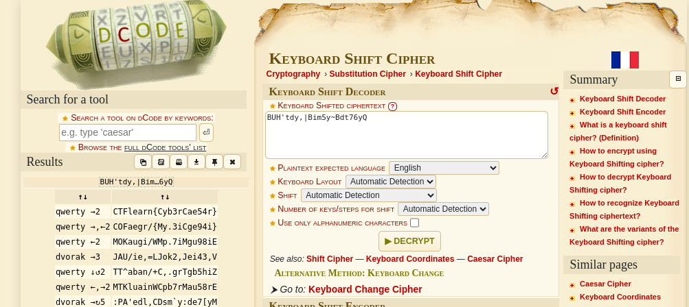

# Modern Gaius Julius Caesar       

One of the easiest and earliest known ciphers but with XXI century twist! Nobody uses Alphabet nowadays right? Why should you when you have your keyboard?

BUH'tdy,|Bim5y~Bdt76yQ

### Step-1: Keyboard shift cipher

Go to https://www.dcode.fr/keyboard-shift-cipher and paste `BUH'tdy,|Bim5y~Bdt76yQ`.



### Step-2: Paste The Flag

```
CTFlearn{Cyb3rCae54r}
```