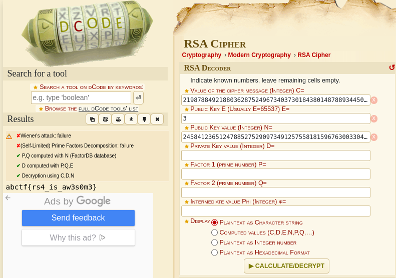

# RSA Beginner         

RSA (Rivest-Shamir-Adleman) is a cryptographic algorithm used for secure data transmission and digital signatures. It generates a pair of keys: a public key for encrypting messages and a private key for decrypting them. The security of RSA relies on the difficulty of factoring large prime numbers. The public key consists of a modulus (n) and an exponent (e), while the private key is derived from the same modulus (n) and a different exponent (d). Encrypting a message involves raising it to the power of (e) and taking the modulus (n), and decryption involves raising the ciphertext to the power of (d) and taking the modulus (n) to retrieve the original message.

### Step-1: Download the .txt

Link: https://mega.nz/#!zD4wDYiC!iLB3pMJElgWZy6Bv97FF8SJz1KEk9lWsgBSw62mtxQg

### Step-2: RSA decoder

`1` Go to: https://www.dcode.fr/rsa-cipher

`2` Paste the appropriate values.

`3` Press `CALCULATE/DECRYPT`.



### Step-3: Paste The Flag

```
abctf{rs4_is_aw3s0m3}
```