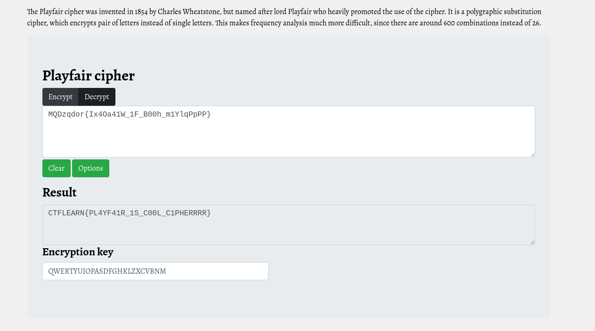

# Suspecious message        

Author says:

Hello! My friend Fari send me this suspecious message: 'MQDzqdor{Ix4Oa41W_1F_B00h_m1YlqPpPP}' and photo.png. Help me decrypt this!

### Step-1: Download the .png


[FILE](photo.png)

### Step-2: Playfair cipher

When I saw `photo.png` I immediately knew that we have to use `Playfair cipher`.

To decode it, I used: https://www.boxentriq.com/code-breaking/playfair-cipher

This `playfair` decoder is the best. It's the first one that pops out in `google` and I recommend it.



### Step-3: Paste The Flag

```
CTFLEARN{PL4YF41R_1S_C00L_C1PHERRRR}
```