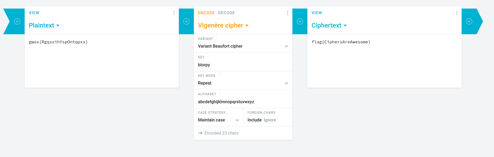

# Vigenere Cipher      

The Vigenère cipher is a classical polyalphabetic encryption method that uses a key to alter the alphabet in the plaintext. Each letter in the plaintext is shifted by the value of the corresponding letter in the key, creating the ciphertext. The key is repeated to match the length of the plaintext, making it difficult to break the cipher using simple frequency analysis. The Vigenère cipher was considered very secure until the 19th century, when Charles Babbage developed a method to break it. Despite this, it remains one of the most important historical ciphers, illustrating the evolution of cryptographic techniques.

### Step-1: Online decoder

Come on. Doing it on paper is a waste of time.

I used: https://cryptii.com/pipes/vigenere-cipher



### Step-2: Paste The Flag

```
flag{CiphersAreAwesome}
```