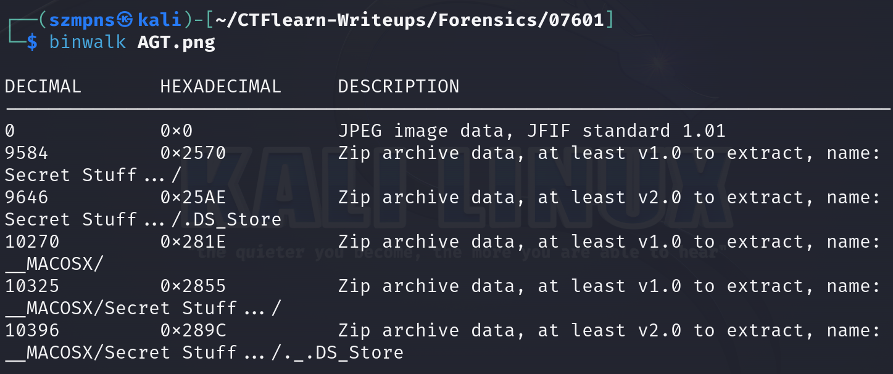
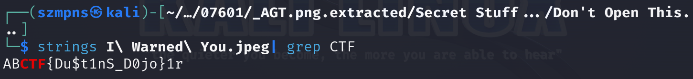

# 07601   

The first computer virus, known as the `Creeper system`, was created in 1971 by Bob Thomas. It was designed not to cause harm but to move between computers on the ARPANET, leaving a message that read, "I'm the creeper: catch me if you can."

### Step-1: Download the .png

https://mega.nz/file/CXYXBQAK#6eLJSXvAfGnemqWpNbLQtOHBvtkCzA7-zycVjhHPYQQ


### Step-2: Binwalk 



There are a lot of files. We have to extract them.

Type:

`binwalk -e AGT.png`

### Step-3: Strings

Go to `_AGT.png.extracted/Secret Stuff.../Don't Open This...`

There is file `'I Warned You.jpeg'`.



There is our flag.

### Step-4: Paste The Flag

```
ABCTF{Du$t1nS_D0jo}
```