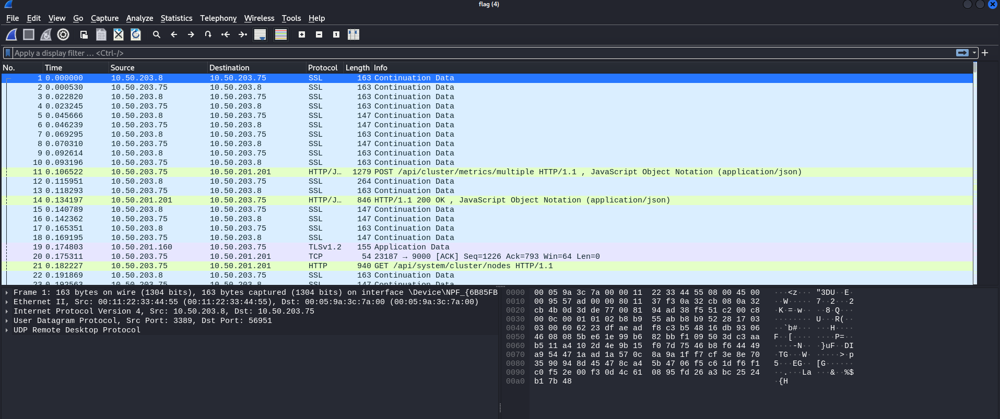
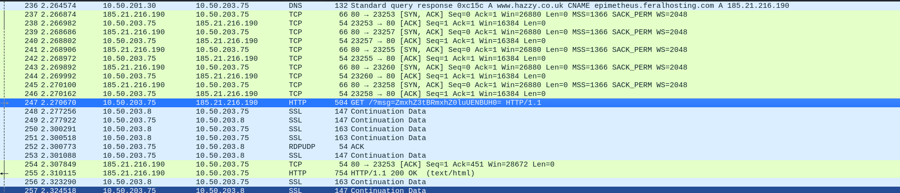
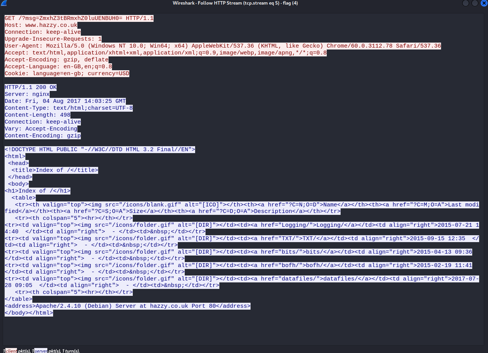
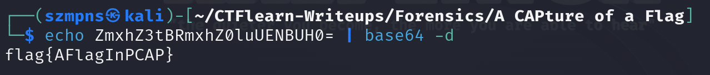

# A CAPture of a Flag     

Author straight up tells us to use wireshark.

### Step-1: Download the file

https://mega.nz/#!DC5F2KgR!P8UotyST_6n2iW5BS1yYnum8KnU0-2Amw2nq3UoMq0Y

### Step-2: Wireshark 

Open `wireshark` go to `file` then `open` and load a file.



Let's search fore some interesting logs.



`Right click` on it, go to `follow` and then `HTTP stream`.



Copy the message `ZmxhZ3tBRmxhZ0luUENBUH0=`

String ended with `=` is almost always `Base64` encoded.

### Step-3: Base64



Done.

### Step-4: Paste The Flag

```
flag{AFlagInPCAP}
```