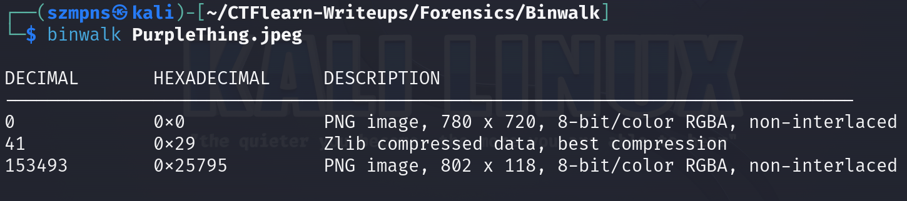

# Binwalk 

`Binwalk` is a tool for searching a given binary image for embedded files and executable code. Specifically, it is designed for identifying files and code embedded inside of firmware images. Binwalk uses the libmagic library, so it is compatible with magic signatures created for the Unix file utility.


### Step-1: Download the .jpeg

`https://mega.nz/#!qbpUTYiK!-deNdQJxsQS8bTSMxeUOtpEclCI-zpK7tbJiKV0tXYY`


### Step-2: Binwalk



The `binwalk` output shows that `PurpleThing.jpeg` contains two embedded PNG images and a section of Zlib compressed data. The first PNG image starts at offset 0, and the second PNG image starts at offset 153493, with Zlib compressed data found at offset 41. This indicates that the JPEG file includes hidden files or data within it.

### Step-3: Foremost

We are going to use foremost to recover this files.


Now open the file `open output/png/00000299.png` and here comes the flag.

### Step-4: Paste The Flag

```
ABCTF{b1nw4lk_is_us3ful}
```

