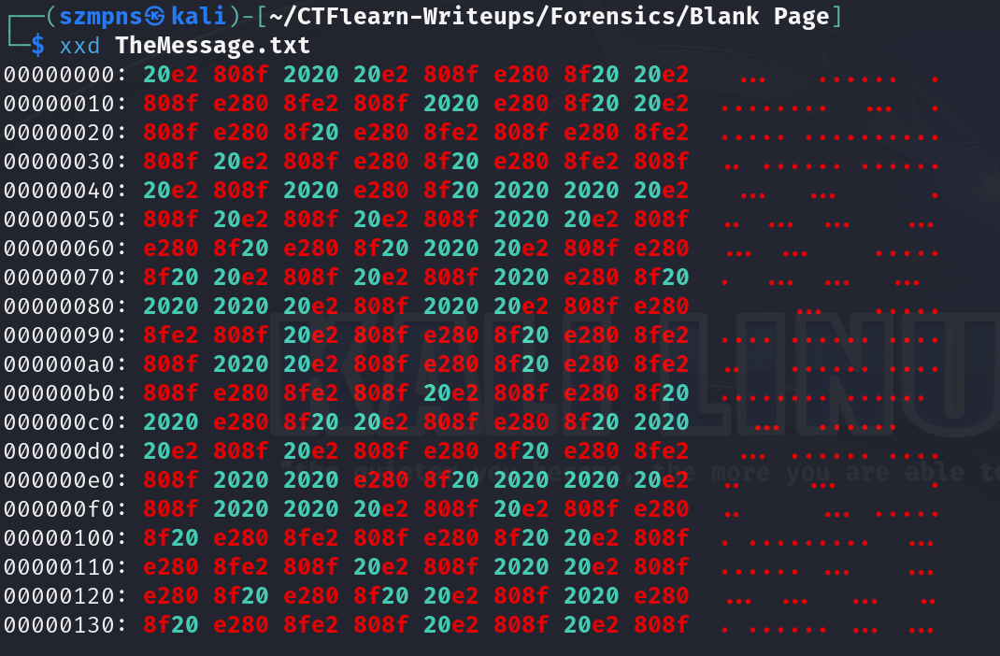
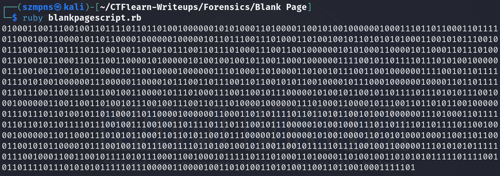
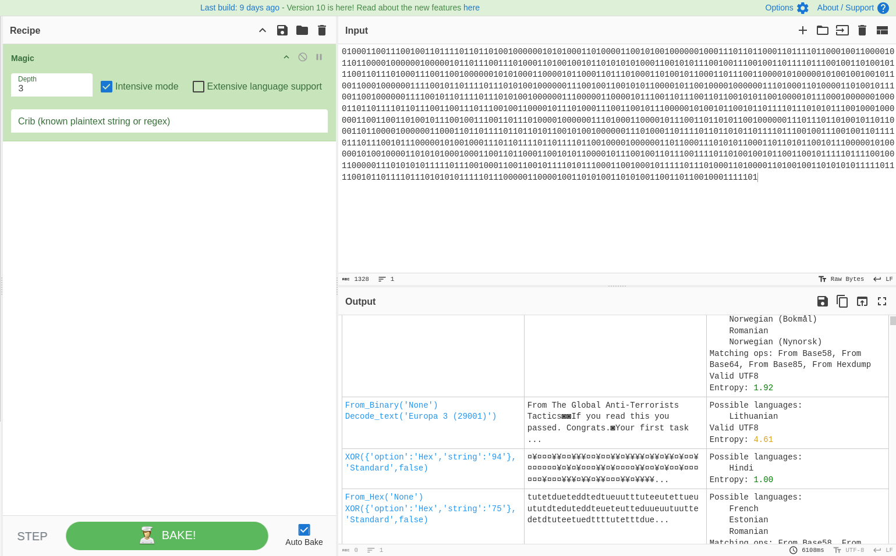
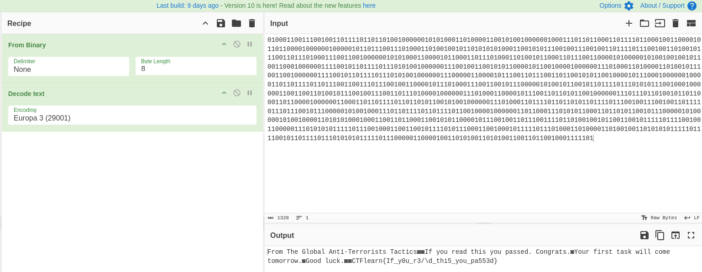

# Blank Page  

I've just graduated the Super Agent School. This is my first day as a spy. The Master-Mind sent me the secret message, but I don't remember how to read this. Help!

### Step-1: Download the .txt

[FILE](TheMessage.txt)

### Step-2: xxd

Type:

```
xxd TheMessage.txt 
```



We can see `blank spaces` and `dots`.

The main idea is to replace `empty spaces` with `0` and `occupied spaces` with `1`.

### Step-3: Write a script

Mine is in `Ruby`:

```ruby
blank_file = "TheMessage.txt"

data = File.read(blank_file)

message = ""

for i in 0...data.length
    if data[i] == " "
        message += "0"
    else
        message += "1"
    end 
end

puts message
```

Execute it.



### Step-4: Cyberchef

Copy the script output and paste it into `Cyberchef`.

Let's use `Magic` with an `Intensive mode`.



Time to look for interesting results.



Here is our `flag`.

### Step-5: Paste The Flag

```
CTFlearn{If_y0u_r3/\d_thi5_you_pa553d}
```