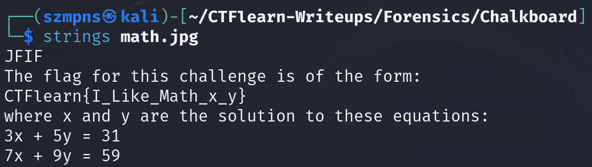
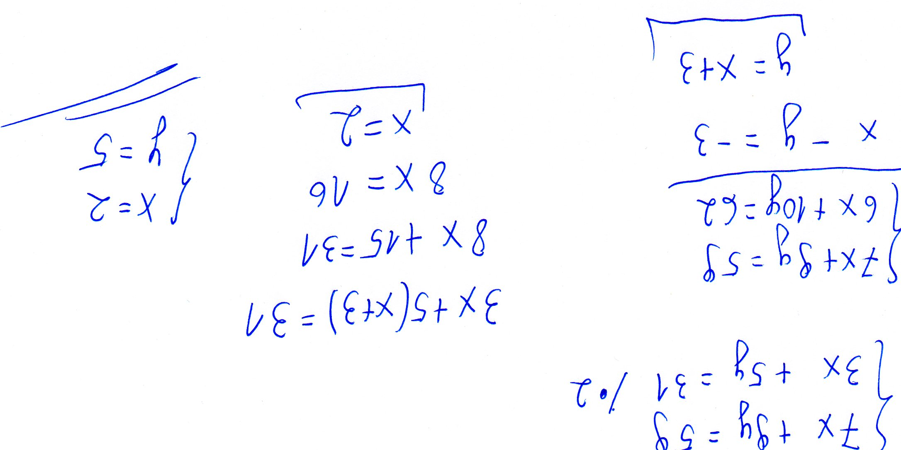

# Chalkboard 

Do you know math?

### Step-1: Download the .jpg


[FILE](math.jpg)

### Step-2: Strings



```
The flag for this challenge is of the form:
CTFlearn{I_Like_Math_x_y}
where x and y are the solution to these equations:
3x + 5y = 31
7x + 9y = 59

```

### Step-3: Grab the paper and solve the equation



`x = 2 and y = 5`

### Step-4: Paste The Flag

```
CTFlearn{I_Like_Math_2_5}
```

