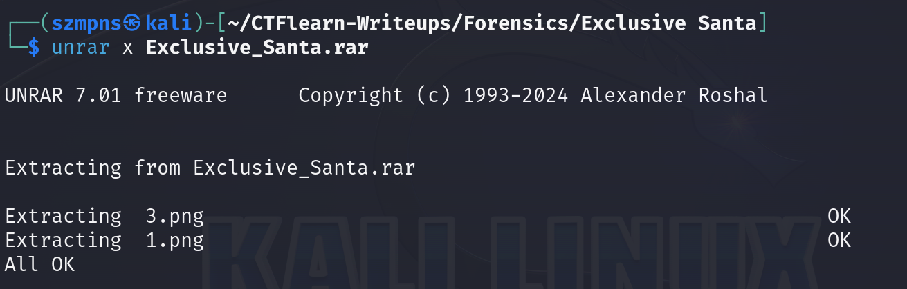
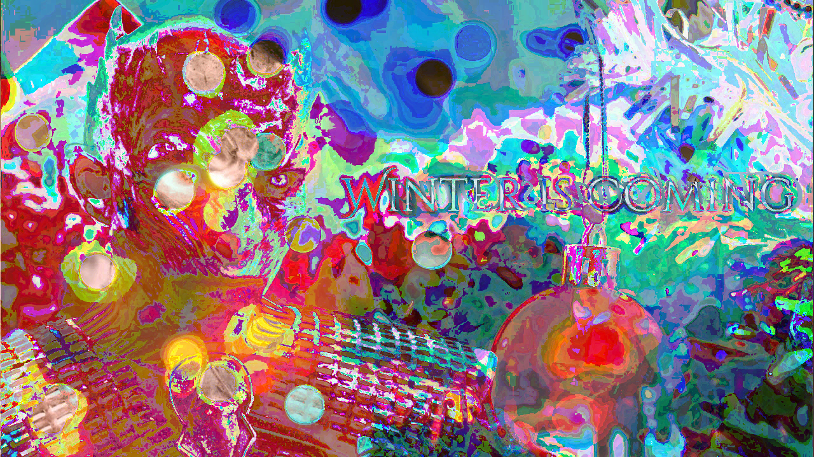
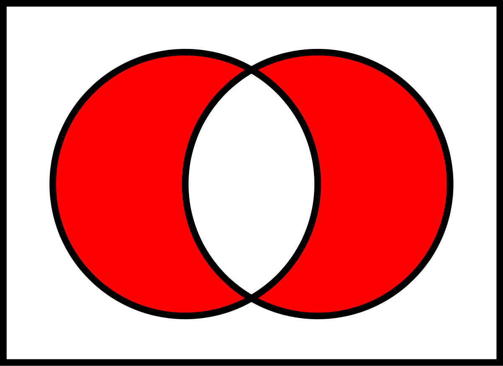
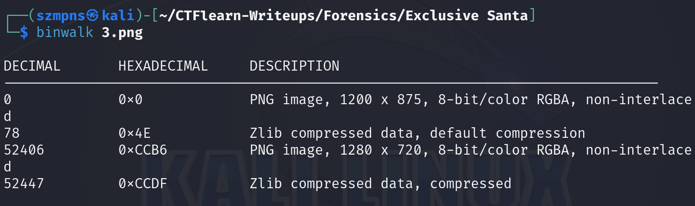
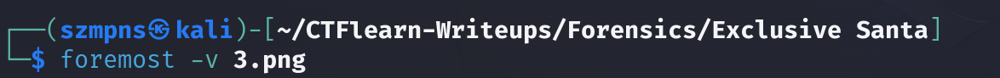
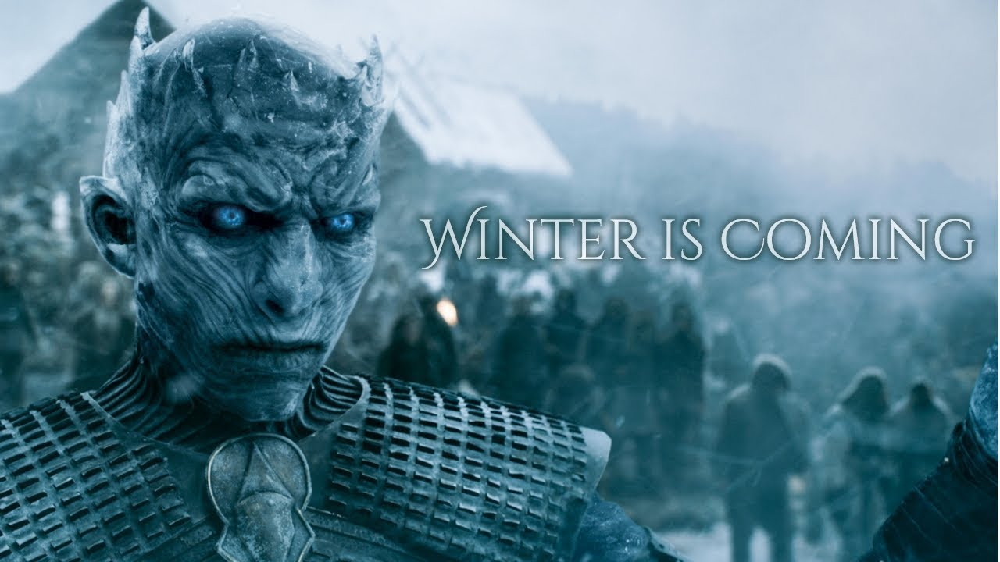
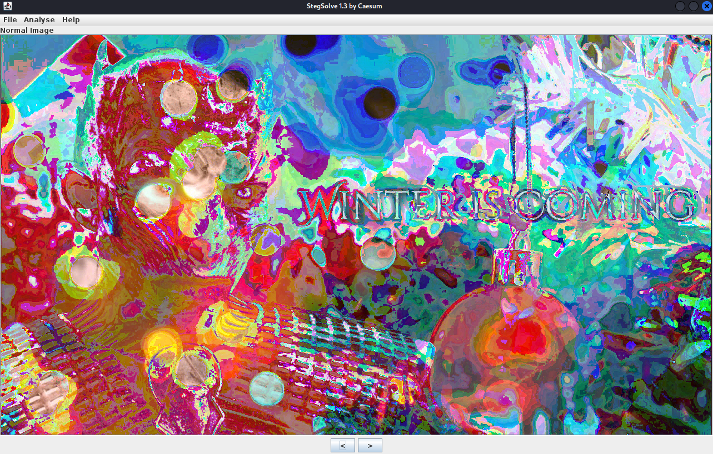
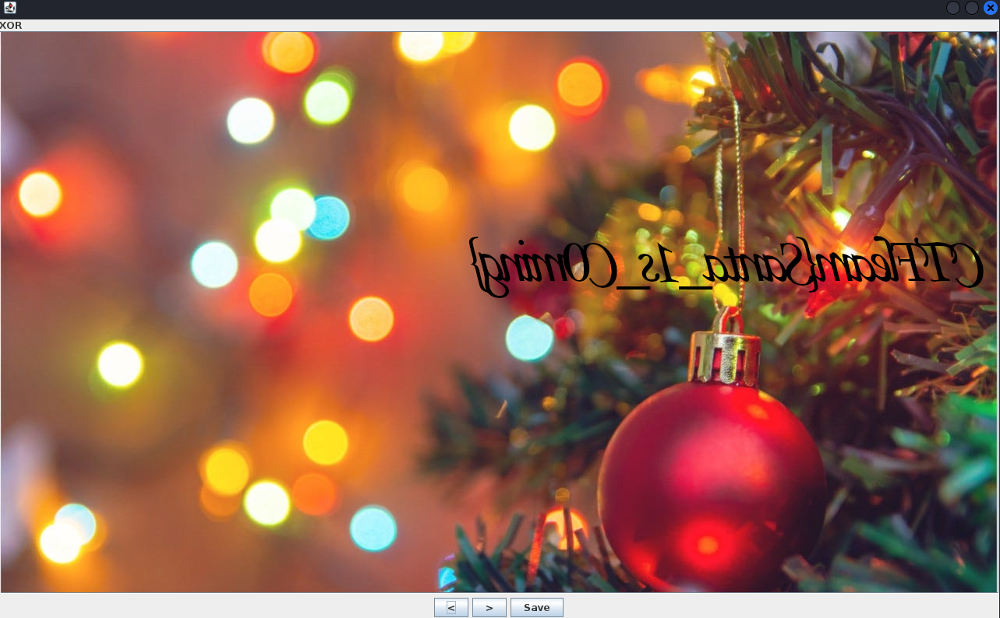
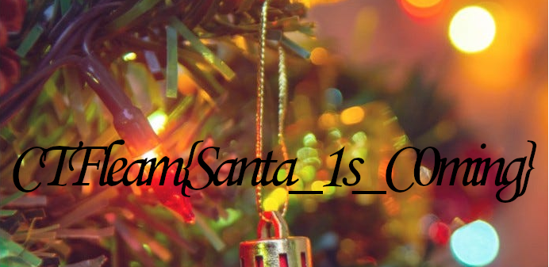

# Exclusive Santa      

Saint Nicholas, also known as Santa Claus, originated from a 4th-century bishop in modern-day Turkey, famous for his generosity. His current image of a jolly man in a red suit was popularized by Coca-Cola's 1930s advertising campaign. In different countries, Santa has unique traditions, like arriving by steamboat from Spain in the Netherlands or living in Lapland, Finland.

### Step-1: Download the .rar

The link is in the challenge description.

Name is `Exclusive_Santa.rar`.

### Step-2: Unrar 

Let's unpack it.



We receive two `.png` files.

`1.png`


`3.png`


### Step-3: Binwalk

`1.png` has nothing fascinating but `3.png` contains other `.png` file. Let's recover it.



### Step-4: Foremost

Type:



Then go to `output/png`.

There are two `.png` files.




### Step-5: Stegsolve

Download stegsolve.

https://github.com/zardus/ctf-tools/blob/master/stegsolve/install

You can do that by simply just pasting two lines below when you are in your preferred directory.
```
1) wget http://www.caesum.com/handbook/Stegsolve.jar -O stegsolve.jar
2) chmod +x stegsolve.jar
```
Open it:

```
java -jar stegsolve.jar 
```

Now go to `File` -> `Open` and load the `1.png`.



Then go to `Analyse` -> `Image Combiner` and load `00000102.png`.



We can flip it and here comes the flag.



### Step-6: Paste The Flag

```
CTFLearn{Santa_1s_C0ming}
```