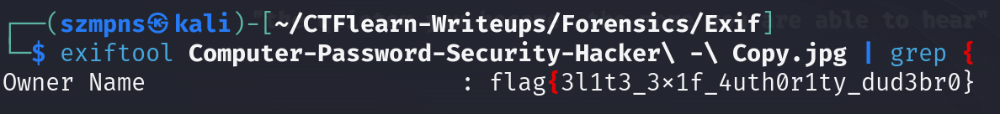

# Exif 

`ExifTool` is a platform-independent Perl library plus a command-line application for reading, writing and editing meta information in a wide variety of files.

### Step-1: Download the .jpg

`https://mega.nz/#!SDpF0aYC!fkkhBJuBBtBKGsLTDiF2NuLihP2WRd97Iynd3PhWqRw `


### Step-2: Exiftool + Grep

Here comes the flag:




### Step-3: Paste The Flag

```
flag{3l1t3_3x1f_4uth0r1ty_dud3br0}
```

