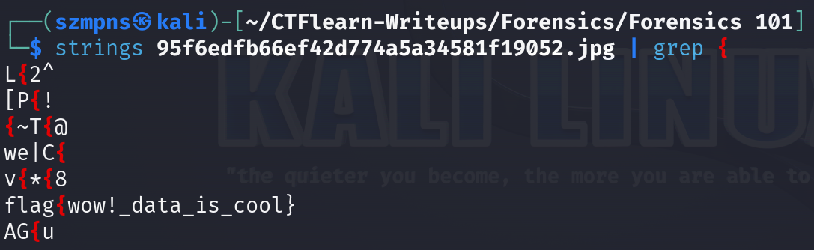

# Forensics 101 

In this task, we will analyze a JPG file to uncover a hidden flag using strings and grep commands.

### Step-1: Download the JPG

`https://mega.nz/file/OHohCbTa#wbg60PARf4u6E6juuvK9-aDRe_bgEL937VO01EImM7c`


### Step-2: Strings + Grep

To speed up the process, we always want to grep the output for flag brackets like `{` or other phrases related to the current problem.



### Step-3: Paste The Flag

```
flag{wow!_data_is_cool}
```
