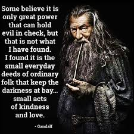
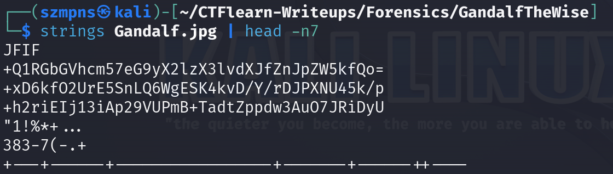
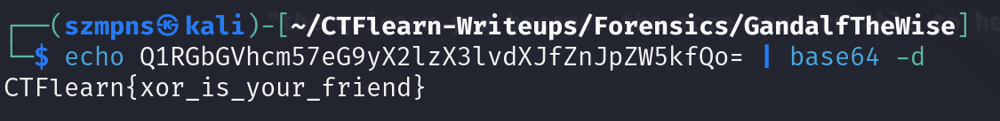

# GandalfTheWise  

XOR (exclusive OR) is a bitwise operation that takes two binary inputs and returns a binary output. The result is `1` if the corresponding bits of the inputs are different, and `0` if they are the same. XOR is commonly used in cryptography for its properties of reversibility and commutativity, allowing for simple encryption and decryption processes. It is also used in error detection and correction algorithms.

### Step-1: Download the .jpg



[FILE](Gandalf.jpg)

### Step-2: Strings



There are three interesting strings. One is definitely encoded with `base64`.

### Step-3: Base64



`CTFlearn{xor_is_your_friend}`

This is not a flag, however, it is certainly an information for us.

### Step-4: XOR

First of all, we have to consider which strings we wanna `XOR`. We have narrowed down our set to three strings from `Step-2`. First one was simply a hint, so we should try to `XOR` the other ones.

XOR is commutative. This means that the result of the XOR operation does not depend on the order of the operands. In other words, `a ⊕ b` is equivalent to `b ⊕ a`.

I wrote a python script:

```
import base64

a = "xD6kfO2UrE5SnLQ6WgESK4kvD/Y/rDJPXNU45k/p"

b = "h2riEIj13iAp29VUPmB+TadtZppdw3AuO7JRiDyU"

decoded_a = base64.b64decode(a)
decoded_b = base64.b64decode(b)

result = bytearray()

for i in range(min(len(decoded_a), len(decoded_b))):
    result.append(decoded_a[i] ^ decoded_b[i])


print(result.decode())
```
Type:

`python3 base64XOR.py`

The outcome is:

`CTFlearn{Gandalf.BilboBaggins}`

### Step-5: Paste The Flag

```
CTFlearn{Gandalf.BilboBaggins}
```
