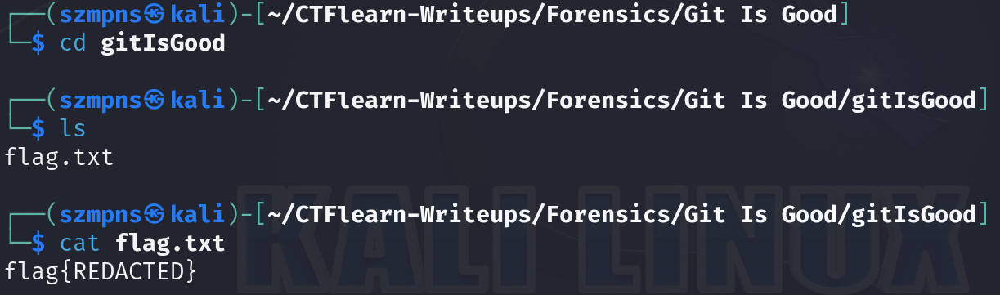
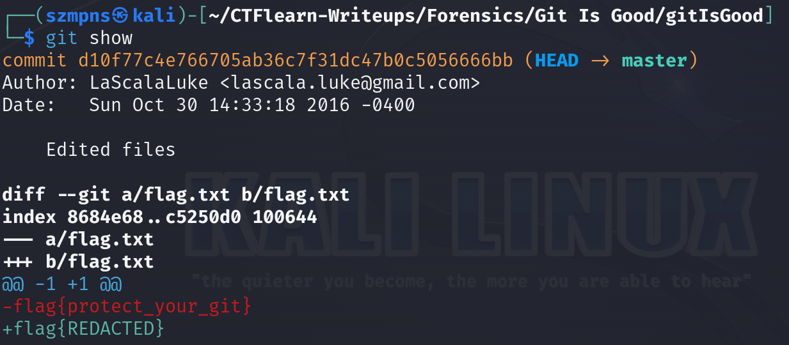

# Git Is Good 

`Git` is a distributed version control system used to track changes in source code during software development. It allows multiple developers to work on a project simultaneously, managing versions and branches, and providing tools to merge code changes. `Git` is commonly used in collaborative environments to maintain the history of project files, facilitate code reviews, and support continuous integration workflows.

### Step-1: Download the .zip

`https://mega.nz/#!3CwDFZpJ!Jjr55hfJQJ5-jspnyrnVtqBkMHGJrd6Nn_QqM7iXEuc`

Then unzip it 

### Step-2: Git



The `flag.txt` file was modified in one of the commits, changing the flag to `REDACTED`. To see the previous version of the flag, we can review the commit history and display the changes made to the file.

Type `git show`:




### Step-3: Paste The Flag

```
flag{protect_your_git}
```