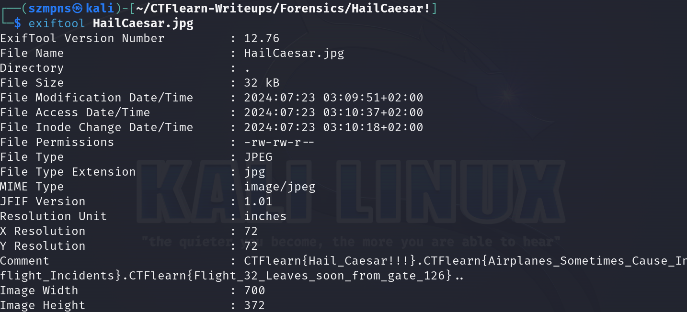
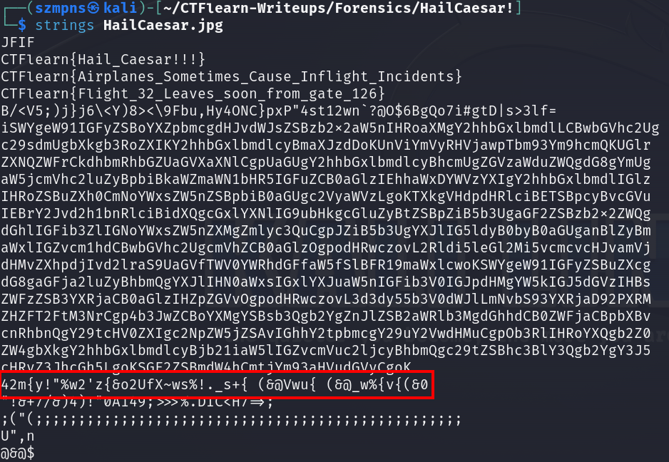
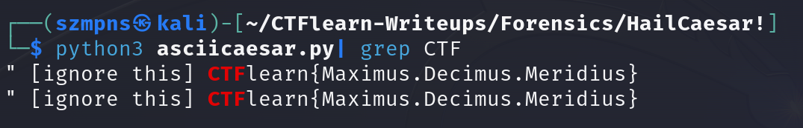

# HailCaesar!        

The Caesar cipher is a classic encryption technique where each letter in the plaintext is shifted a certain number of places down or up the alphabet. Named after Julius Caesar, who used it in his private correspondence, this cipher is one of the simplest and most widely known encryption methods. A historical curiosity is that Caesar reportedly used a shift of three for his messages. Despite its simplicity, the Caesar cipher is the foundation for many more complex encryption algorithms used today.

### Step-1: Download the .jpg


[FILE](HailCaesar.jpg)

And btw, none of these is flag, sorry.



### Step-2: Strings 



This is the fragment that might be interesting for us:

`42m{y!"%w2'z{&o2UfX~ws%!._s+{ (&@Vwu{ (&@_w%{v{(&0` 

### Step-3: Python script  

We have to decode `ASCII in Cesar` cipher.

This script is gonna help us:

```
def ascii_caesar_shift_decrypt(message, shift):
    decrypted = ""
    for char in message:
        new_value = ord(char) - shift
        
        if new_value < 32:
            new_value += 95 
        elif new_value > 126:
            new_value -= 95
        
        decrypted += chr(new_value)
    return decrypted

encrypted_message = """42m{y!"%w2'z{&o2UfX~ws%!._s+{ (&@Vwu{ (&@_w%{v{(&0"""

for i in range(-100, 100):
    print(ascii_caesar_shift_decrypt(encrypted_message, i))

```

Then use `grep` to find the flag:



### Step-4: Paste The Flag

```
CTFlearn{Maximus.Decimus.Meridius}
```