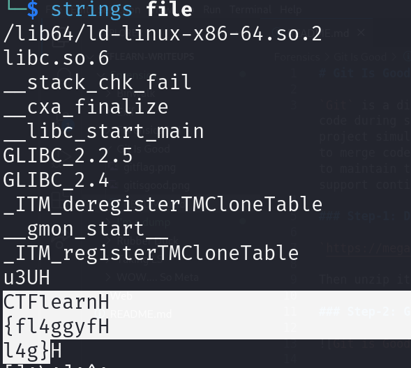

# I'm a dump 

The keyword is hexadecimal, and removing an useless H.E.H.U.H.E. from the flag. The flag is in the format CTFlearn{*}

### Step-1: Download the file

[FILE](file)

### Step-2: Strings



After removing all the H's we receive the flag.

### Step-3: Paste The Flag

```
CTFlearn{fl4ggyfl4g}
```
