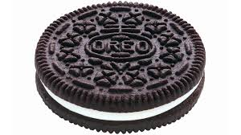
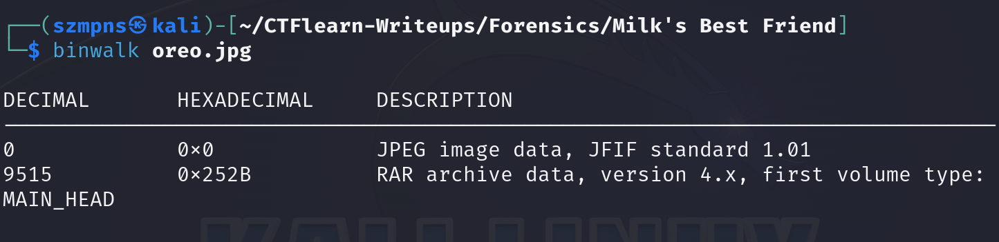
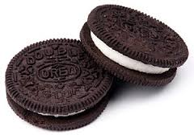
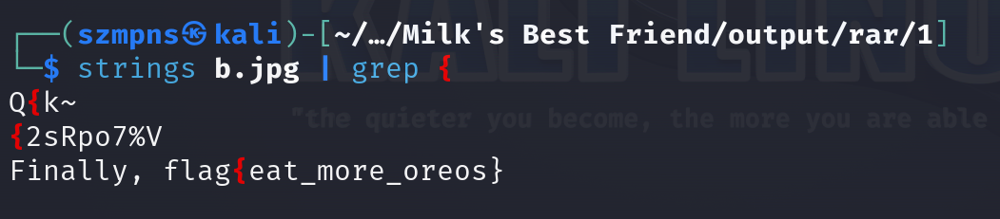

# Milk's Best Friend    

Oreo cookies were first introduced in 1912 by the National Biscuit Company (now Nabisco) in the United States. The original design featured a wreath around the edge and the name "Oreo" in the center. The cookie was initially marketed as an imitation of the Hydrox cookie, which had been released by the Sunshine company four years earlier. Over the decades, Oreo has become the best-selling cookie in the U.S. and has expanded globally, with numerous variations in flavor and filling. The iconic design we recognize today, with the intricate pattern on the cookie, was developed in 1952.

### Step-1: Download the .jpg

https://mega.nz/#!DC5F2KgR!P8UotyST_6n2iW5BS1yYnum8KnU0-2Amw2nq3UoMq0Y



### Step-2: Strings 

After pasting `strings oreo.jpg` we can see at the very end:

`This is not the flag you are looking for.Q"t`

### Step-3: Binwalk



There is hidden data.

### Step-4: Foremost

Use foremost to recover it.


### Step-5: Unrar

Go to `output/rar`. There should be a .rar file named `00000018.rar`.

Type `unrar x 00000018.rar` to unpack it.


### Step-6: Strings again + grep

We need to be in the `output/rar/1` path. There is a file named `b.jpg`.



Let's end it.



Here is our flag.

### Step-7: Paste The Flag

```
flag{eat_more_oreos}
```