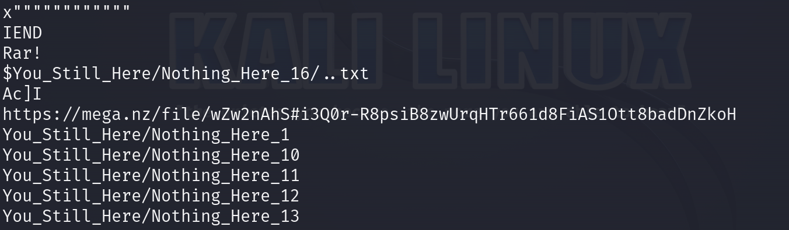
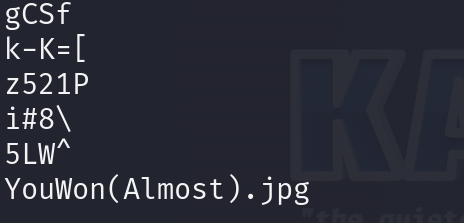
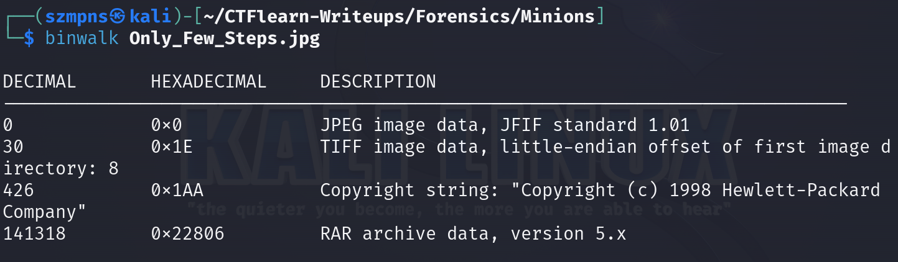
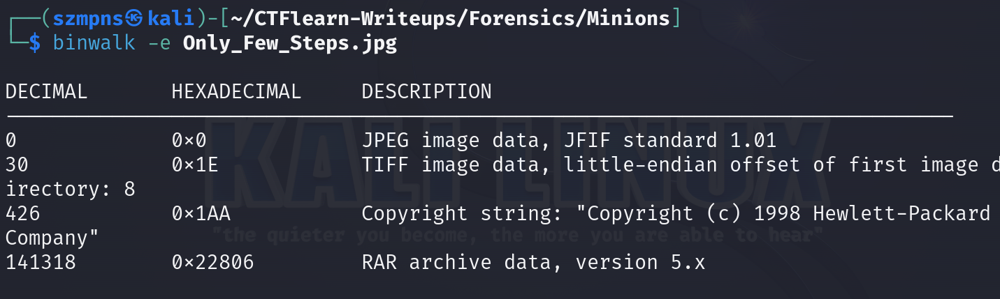
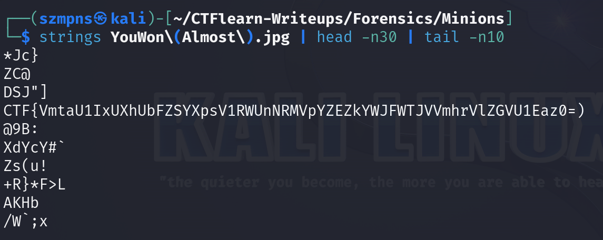
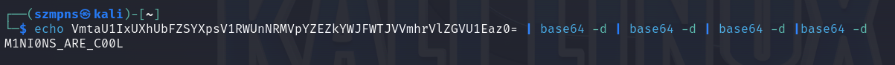

# Minions  

It is good to always carefully read instructions provided by author.

### Step-1: Download the .png

https://mega.nz/file/1UBViYgD#kjKISs9pUB4E-1d79166FeX3TiY5VQcHJ_GrcMbaLhg


### Step-2: Strings

Just paste in your terminal `strings Hey_You.png`



We can see the link: 

https://mega.nz/file/wZw2nAhS#i3Q0r-R8psiB8zwUrqHTr661d8FiAS1Ott8badDnZkoH

Let's download another photo.


Paste in terminal `strings Only_Few_Steps.jpg`

We can see:



There is definitely some data hidden in this file.

### Step-3: Binwalk



We have to recover these files.



Now go to `_Only_Few_Steps.jpg.extracted`

There is a `YouWon(Almost).jpg`


### Step-4: Strings again



`CTF{VmtaU1IxUXhUbFZSYXpsV1RWUnNRMVpYZEZkYWJFWTJVVmhrVlZGVU1Eaz0=)`

Phrase in brackets is encoded with `base64`.

### Step-5: Base64

Using the author hints:



Here it is.

### Step-6: Paste The Flag

```
CTFlearn{M1NI0NS_ARE_C00L}
```