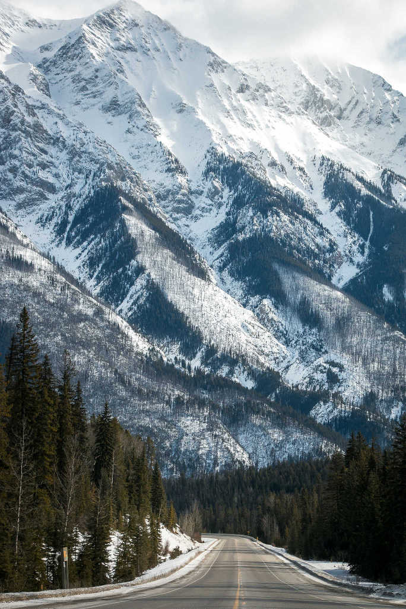
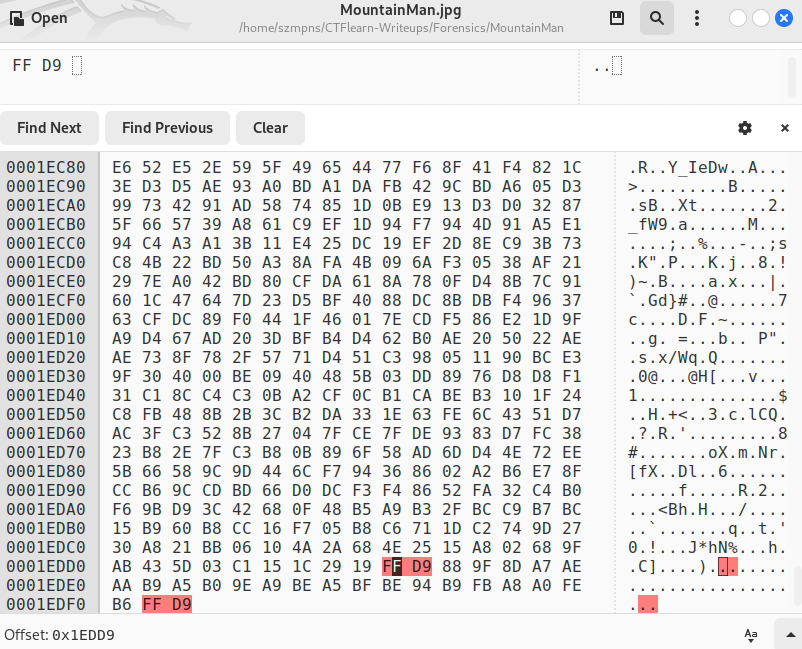
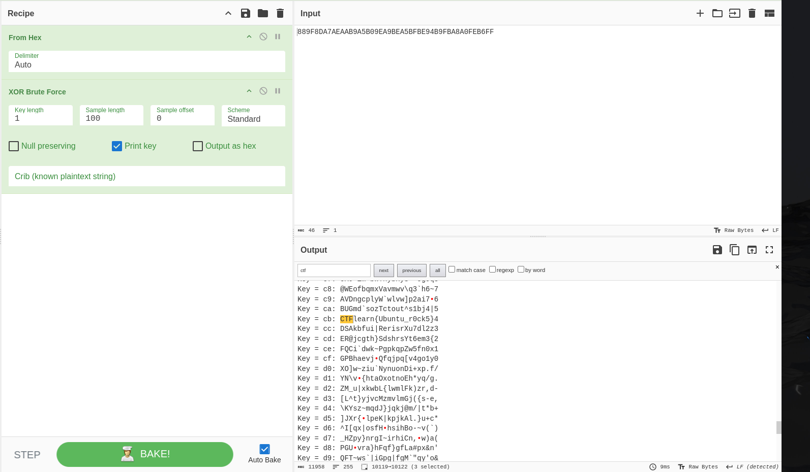

# MountainMan       

The hint by author is important.

`Don't be fooled by two 0xffd9 markers. xor is your friend.`

### Step-1: Download the .jpg



[FILE](MountainMan.jpg)

### Step-2: Ghex 

Open file `ghex MountainMan`.

Press `Ctrl + F` and search for `FF D9`.



In the context of file formats such as JPEG images, the value `0xffd9` can be the end marker of a JPEG file (EOI - End of Image). In the JPEG standard, files start with the markers 0xffd8 (SOI - Start of Image) and end with the marker `0xffd9`.

### Step-3: Cyberchef

In given file, we have two `0xffd9` values which is unusual.

Let's copy:

```
88 9F 8D A7 AE AA B9 A5 B0 9E A9 BE A5 BF BE 94 B9 FB A8 A0 FE B6 FF D9
```

Cyberchef `magic` mode didn't work. We have to use `From Hex` and then `XOR Brute Force`.



Search all the keys and you should find the flag.

### Step-4: Paste The Flag

```
CTFlearn{Ubuntu_r0ck5}
```