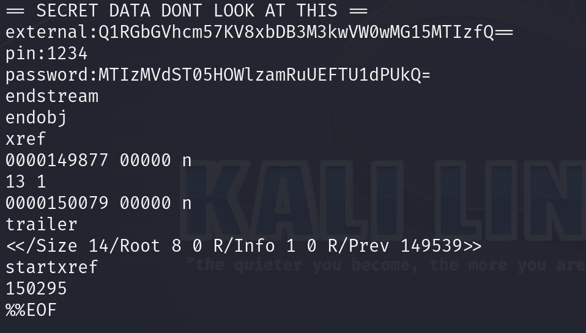
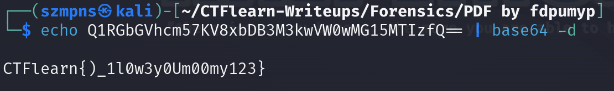

# PDF by fdpumyp  

`Base64` encoded strings often end with one or two padding characters, which are equal signs `=`. The number of padding characters (none, one, or two) depends on the length of the input data and ensures that the output string length is a multiple of four.

### Step-1: Download the .pdf

[FILE](dontopen.pdf)

### Step-2: Strings

Just paste in your terminal `strings dontopen.pdf`



We can see that there is some `SECRET DATA DONT LOOK AT THIS` sequence. There are some base64 encoded strings as they are ending with `==` or `=` so we must check it.

### Step-3: Base64



First one was a flag.

### Step-4: Paste The Flag

```
CTFlearn{)_1l0w3y0Um00my123}
```
