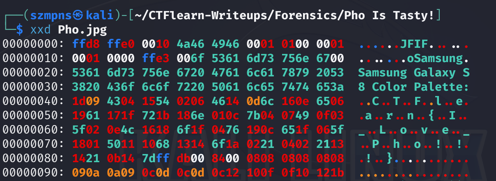

# Pho Is Tasty!   

`xxd` is a command-line tool that is primarily used for creating and analyzing hexadecimal dumps from files. It can also be used to reverse the process and convert a hexadecimal dump back into binary form. 

### Step-1: Download the .jpg


[FILE](Pho.jpg)

### Step-2: xxd

Strings or Exiftool won't help you. We are going to use `xxd`.



Here is our flag.

### Step-3: Paste The Flag

```
CTFlearn{I_Love_Pho!!!}
```
