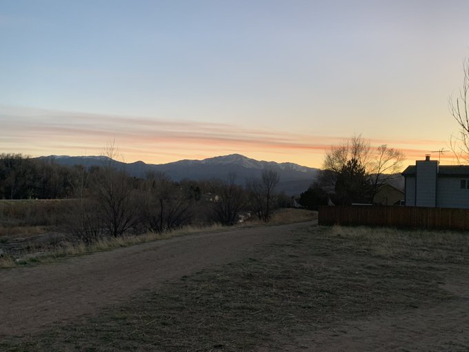
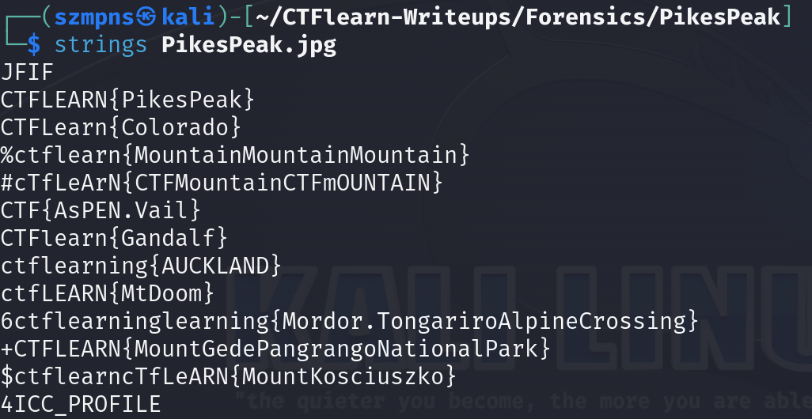

# PikesPeak 

This challenge is somewhat pointless because it is very easy and we have to at some point "bruteforce" the flag as we receive several possible flag combinations.

### Step-1: Download the .jpg



[FILE](PikesPeak.jpg)

### Step-2: Strings



We can see a lot of flags but only one gives us desired format `CTFlearn{}`.

### Step-3: Paste The Flag

```
CTFlearn{Gandalf}
```

