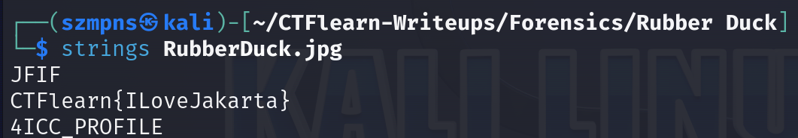

# Rubber Duck 

`Strings` is a command-line tool used to extract and display readable text strings from binary files. It scans files and identifies sequences of printable characters, making it useful for finding hidden text, such as passwords or flags, embedded in executables, images, or other binary formats. `Strings` is commonly used in reverse engineering and digital forensics to quickly analyze the contents of binary files.

### Step-1: Download the .jpg


[FILE](RubberDuck.jpg)

### Step-2: Strings

Here comes the flag:




### Step-3: Paste The Flag

```
CTFlearn{ILoveJakarta}
```

