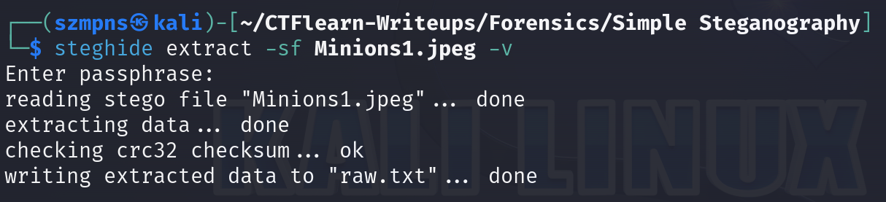

# Simple Steganography    

`Steghide` is a steganography tool used to hide and extract data within image and audio files. It supports various file formats and offers encryption to protect hidden data, making it useful for securely embedding information. Commonly used in digital forensics and CTF challenges, `steghide` helps uncover concealed data without altering the visible properties of the files.

### Step-1: Download the .jpeg


[FILE](Minions1.jpeg)

### Step-2: xxd or strings


`myadmin`

We want to save that phrase because the author suggest us using the `steghide` and in many cases this tool requires password to extract data from files.

### Step-3: Steghide

The command `steghide extract -sf Minions1.jpeg -v` extracts hidden data from the specified stego file `Minions1.jpeg` with detailed output.



As `passphrase` we must type `myadmin`.

### Step-4: Base64

The `steghide` gave us `raw.txt` file. In CTFs we usually want to check if the string or plaintext is encoded by `Base64`. It does not cost us many time and sometimes speeds up the process.


It definitely helped.

### Step-5: Paste The Flag

```
CTFlearn{this_is_fun}
```
