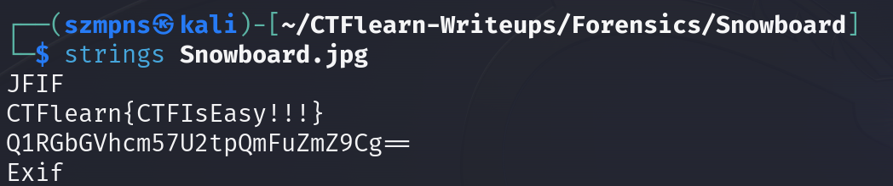

# Snowboard 

`Base64` is an encoding scheme used to convert binary data into an ASCII string format by encoding it into a base-64 representation. It is commonly used to encode data for transmission over media that are designed to handle text, ensuring that the data remains intact without modification during transport.

### Step-1: Download the .jpg


[FILE](Snowboard.jpg)

### Step-2: Strings



We can see `CTFlearn{CTFIsEasy!!!}` string but it unfortunately is not the flag.

### Step-3: Base64

We always want to check strings ending with `==`. It gives us straight information that it is base64 encoded.

Below the false flag there was this sequence:
`Q1RGbGVhcm57U2tpQmFuZmZ9Cg==`

Let's check it:


Here we have the flag.

### Step-4: Paste The Flag

```
CTFlearn{SkiBanff}
```

