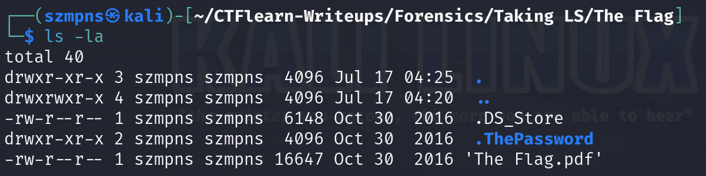

# Taking LS 

The `-la` flag in the `ls` command lists all files and directories, including hidden ones. It also provides detailed information about each file, such as permissions, number of links, owner, group, size and timestamp.

### Step-1: Download the file and unzip it

`https://mega.nz/#!mCgBjZgB!_FtmAm8s_mpsHr7KWv8GYUzhbThNn0I8cHMBi4fJQp8`

### Step-2: Taking the LS

In "The Flag" directory we can find `.pdf` file which is protected. There is no need to crack the password, instead of this, we will use the `ls` command with the `-la` flag.



We can see a hidden folder which contains a password to the `.pdf` file.

### Step-3: Get access to the "The Flag.pdf"


We can finally open protected file:


### Step-4: Paste The Flag

```
ABCTF{T3Rm1n4l_is_C00l}
```

