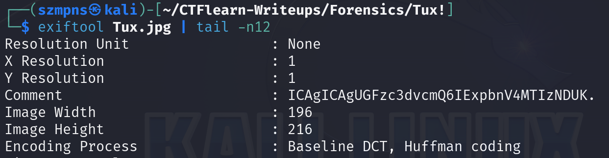
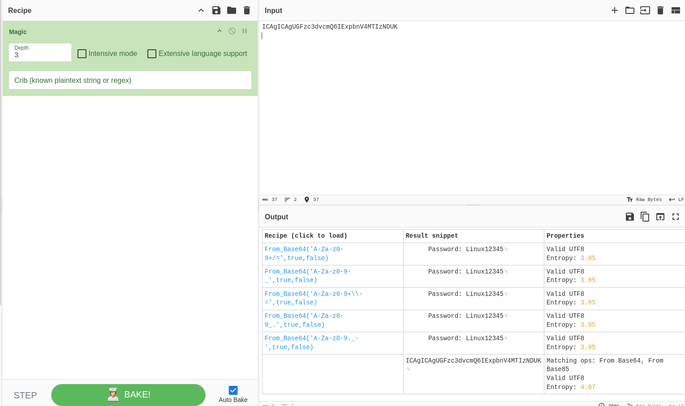
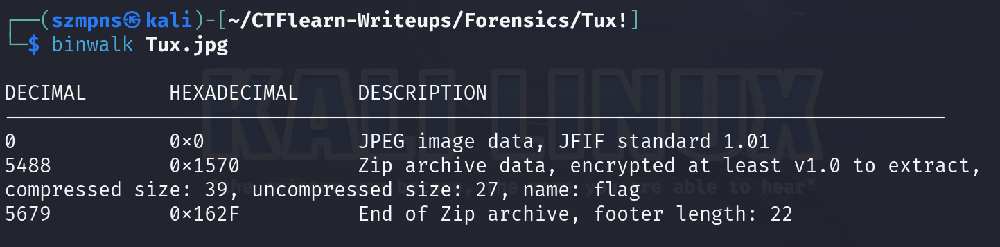
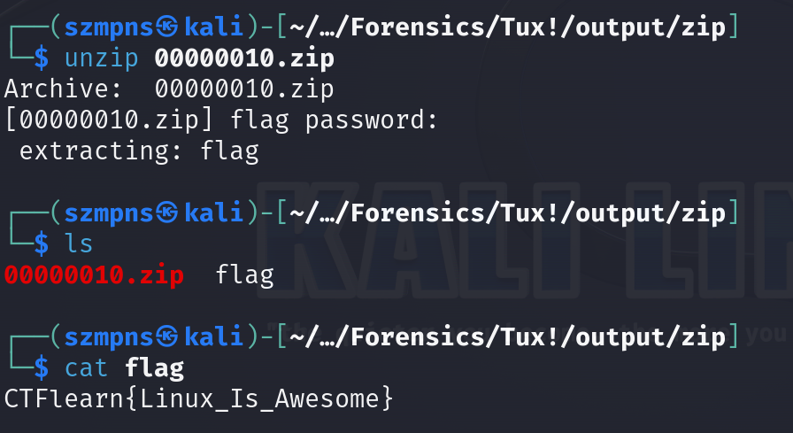

# Tux!  

`Tail` is a command which prints the last few number of lines (10 lines by default) of a certain file, then terminates.

### Step-1: Download the .jpg


[FILE](Tux.jpg)

### Step-2: Strings or Exiftool



`ICAgICAgUGFzc3dvcmQ6IExpbnV4MTIzNDUK`
We want to check this string from the comment. 

### Step-3: Cyberchef

We are going to use Cyberchef with the `Magic` mode.



We got the password which might be helpful in the next steps.

```
Password: Linux12345
```
### Step-4: Binwalk



There is some Zip archive which contains file named `flag`.

### Step-5: Foremost


After this operation go to `output/zip/`.

### Step-6: Unzip

.zip archive is encrypted. You will need to use password from `Step-3: Cyberchef` to unzip it.



### Step-7: Paste The Flag

```
CTFlearn{Linux_Is_Awesome}
```

