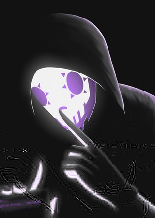
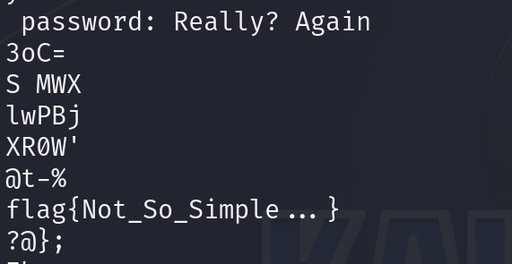
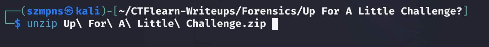
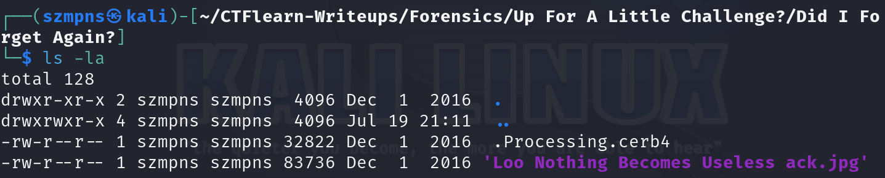
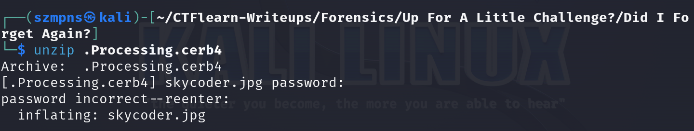
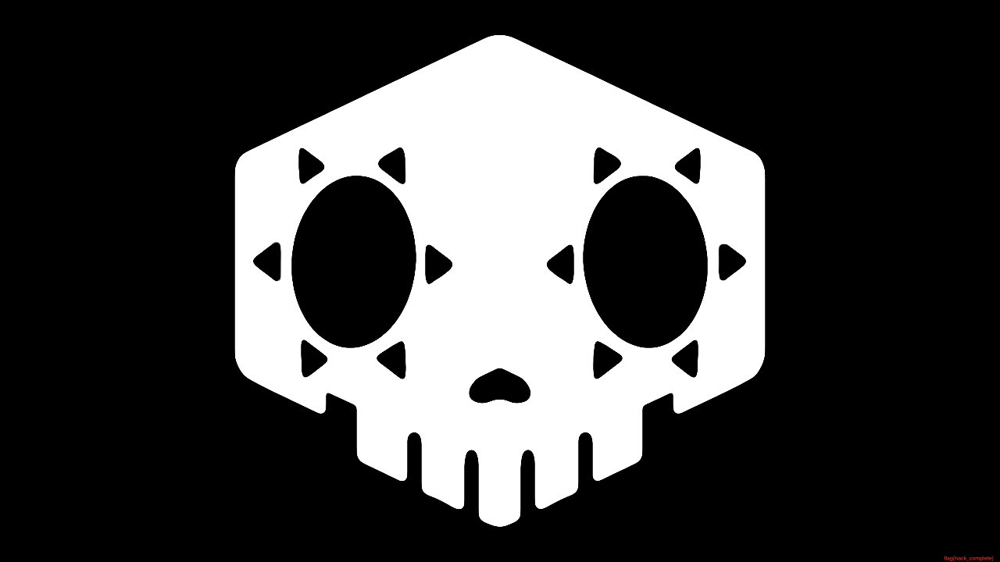

# Up For A Little Challenge?      

I did this challenge twice. Both times I could not see the flag because it was so blurry. Had to spend some time with it to guess.

### Step-1: Download the .jpg

https://mega.nz/#!LoABFK5K!0sEKbsU3sBUG8zWxpBfD1bQx_JY_MuYEWQvLrFIqWZ0



### Step-2: Strings 

Type `strings Begin\ Hack.jpg`

In strings we can find this link:

https://mega.nz/#!z8hACJbb!vQB569ptyQjNEoxIwHrUhwWu5WCj1JWmU-OFjf90Prg

Download the `.zip`.



Sorry, this is not the flag.

Also there is other information:

`Mp real_unlock_key: Nothing Is As It SeemsU`

### Step-3: Unzip



Then go to `'Did I Forget Again?'` directory.

### Step-4: ls -la 



We find there a hidden file.

### Step-5: Unzip again



The password to the zip is string from `Step-2` - `Nothing Is As It Seems`

### Step-6: Open the picture

`open skycoder.jpg `



The flag is the right corner. Just zoom in.

### Step-7: Paste The Flag

```
flag{hack_complete}
```