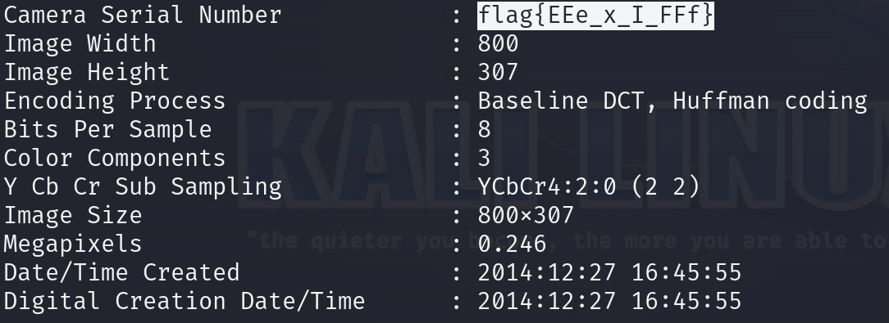

# WOW.... So Meta 

`exiftool` is a command-line application for reading, writing, and editing metadata in a variety of file formats, including images, videos, and PDFs. It supports a wide range of metadata formats such as EXIF, IPTC, and XMP, making it a versatile tool for managing file information. `exiftool` is commonly used in digital forensics and photography to extract and modify embedded metadata.

### Step-1: Download the .jpg

`https://mega.nz/#!ifA2QAwQ!WF-S-MtWHugj8lx1QanGG7V91R-S1ng7dDRSV25iFbk`


### Step-2: Exiftool


Flag is here:




### Step-3: Paste The Flag

```
flag{EEe_x_I_FFf}
```

