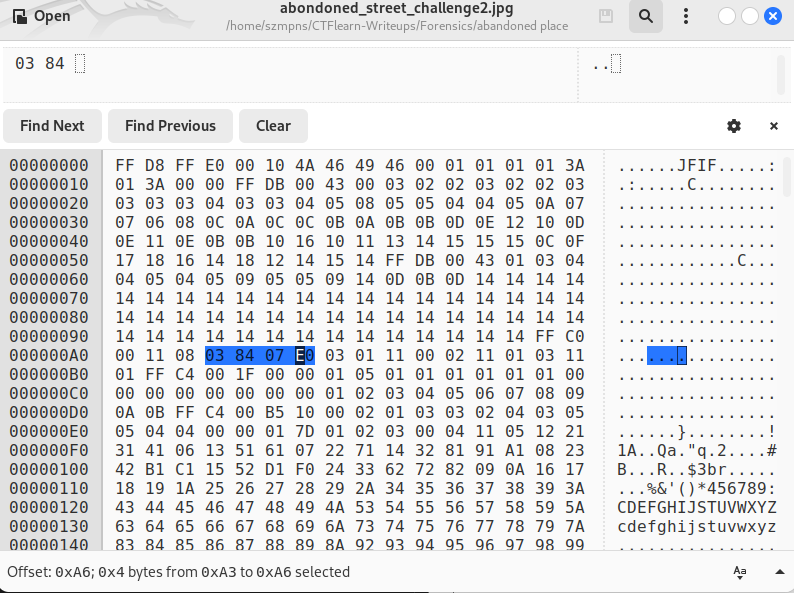
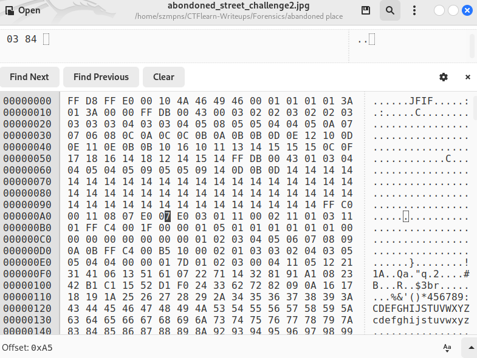
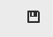
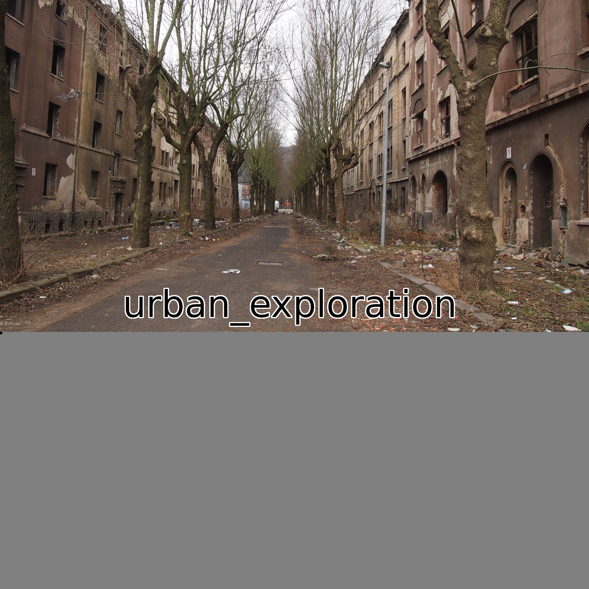

# abandoned place   

Author says: 

The flag is outside of the pic, try to find it. another hint: dimensions, dimensions, everything is in dimensions.

### Step-1: Download the .jpg


[FILE](abondoned_street_challenge2.jpg)

### Step-2: Exiftool 

Just paste `exiftool abondoned_street_challenge2.jpg` and search for dimensions.

```
Image Width                     : 2016
Image Height                    : 900
```
Our goal is to make `abondoned_street_challenge2.jpg` 2016x2016.

### Step-3: Decimal to Hexadecimal

We will need to find 900 in hexeditor later to replace it. Also we must know 2016 value in hexadecimal.

We are going to use Decimal to Hexadecimal converter:

https://www.rapidtables.com/convert/number/decimal-to-hex.html

The values are:

```
2016:  07 E0
900:   03 84
```

### Step-4: Ghex

Type `ghex abondoned_street_challenge2.jpg`.

Then use `Ctr + F` and find `03 84`.



The dimensions are right nex to each other.

Now mark the `03 84` and paste `07 E0` in that place. Make sure you copied 2016 hex value into clipboard before.



Now save it:



### Step-5: Open the picture

Here is our flag.



### Step-6: Paste The Flag

```
CTFlearn{urban_exploration}
```
