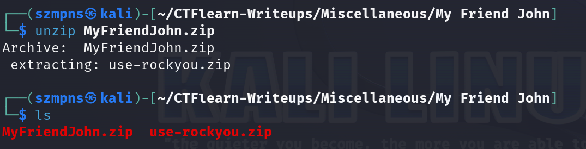
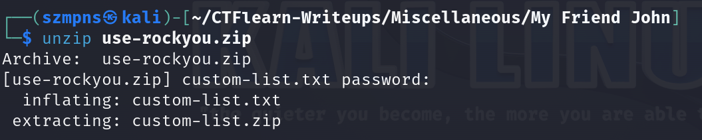

# My Friend John   

`John the Ripper` is a powerful open-source password cracking tool designed to identify weak passwords through various cracking techniques, including dictionary attacks and brute force. Originally developed for Unix-based systems, it now supports a wide range of platforms, including Windows and macOS. It is highly customizable and can be used with different hash algorithms and encryption methods. Users often utilize it to assess the strength of their own passwords or to recover lost passwords, though it must be used responsibly and ethically.

### Step-1: Download the .zip

[FILE](MyFriendJohn.zip)

### Step-2: Unzip

First of all, let's try to `unzip` the `.zip` file.

Type:

```
unzip MyFriendJohn.zip 
```



### Step-3: John the Ripper 

We extracted `use-rockyou.zip`.

Unpacking this file requires a password that remains unknown.

However, the name of this `file` is a hint.

The `rockyou.txt` dictionary is a widely used password list for brute-force and dictionary attacks, originally compiled from a massive data breach of RockYou, a social networking app, in 2009. It contains over 14 million passwords, including many commonly used and easily guessable ones. Security professionals and attackers alike use it to test password strength and perform vulnerability assessments.

Type:

```
zip2john use-rockyou.zip >> {any name you want}.txt
```


Now, when we have our password hash in `.txt` file, type:

```
john --wordlist={path to the rockyou.txt dictionary} {name of the file with password hash}.txt
```

If you don't have `rockyou.txt`, just download form Internet.


Password is `kdbs0429`.

Now type:

```
unzip use-rockyou.zip
```

and provide the password.



We extracted two files - `custom-list.txt` and `custom-list.zip`. 

The `.zip` one is again - password protected.

It looks like `custom-list.txt` is just password dictionary to the `custom-list.zip`.

Type:

```
zip2john custom-list.zip >> {any name you want}.txt
```


Now type:

```
john --wordlist=custom-list.txt {name of the file with password hash}.txt
```


Password is `1N73rD3N0M1N4710N41`.

Now type:

```
unzip custom-list.zip
```

and provide the password.

We extracted `brute-force-pin.zip` file. Again - password protected.

Let's extract another hash:

```
zip2john brute-force-pin.zip >> {any name you want}.txt
```

Because there is `PIN` in the filename we will try to use only `digits`. 

Type:

```
john --incremental=digits {name of the file with password hash}.txt
```


Password is `991337`.

Let's unzip `brute-force-pin.zip` file and provide the password.


Flag is there.

### Step-4: Paste The Flag

```
CTFlearn{s0_n0W_y0uv3_M3t_J0hN}
```
