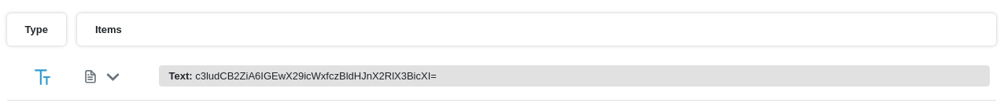
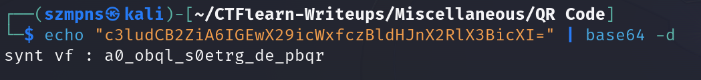
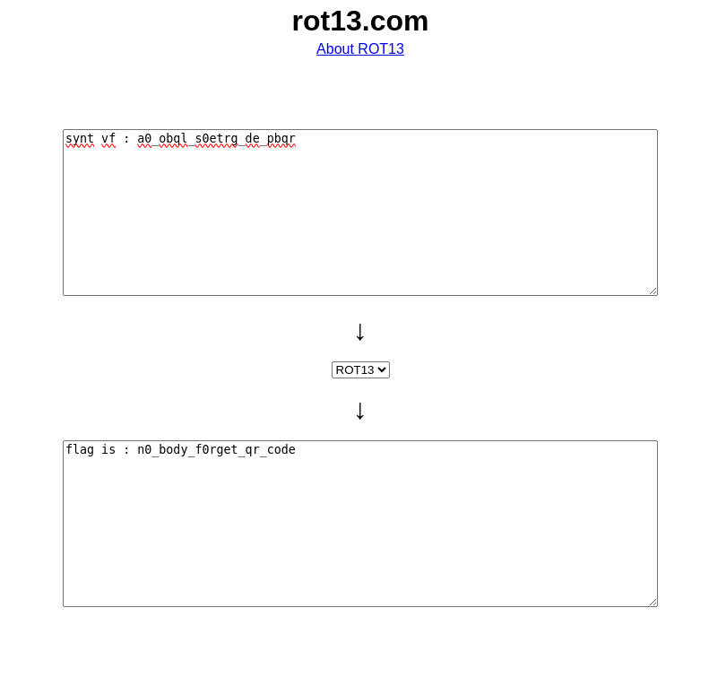

# QR Code          

Did you know that `QR codes` were invented in 1994 by a Japanese company called `Denso Wave`? Initially designed to track automotive parts during manufacturing, `QR codes` can now store a variety of information and are widely used for everything from payment systems to marketing. Interestingly, `Denso Wave` chose not to exercise its patent rights, allowing QR codes to become a global standard without licensing fees.

### Step-1: Download the .png

https://mega.nz/#!eGYlFa5Z!8mbiqg3kosk93qJCP-DBxIilHH2rf7iIVY-kpwyrx-0


### Step-2: Free QR Code Scanner

I used that one: https://dnschecker.org/qr-code-scanner.php



We received following output:

```
c3ludCB2ZiA6IGEwX29icWxfczBldHJnX2RlX3BicXI=
```

It's clearly `base64` encoded.

### Step-3: Base64



The `string` of characters looks like it was encoded with a `Caesar cipher`.

### Step-4: ROT13

I used this website: https://rot13.com/ to do it fast. You can also use `Cyberchef`.



### Step-5: Paste The Flag

```
n0_body_f0rget_qr_code
```