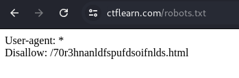
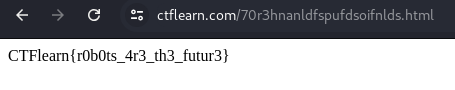

# Where Can My Robot Go?           

The `robots.txt` file is a text file used by websites to communicate with web crawlers and robots from search engines. It specifies which parts of the site should be indexed and which should be excluded. The file is located in the root directory of a website (e.g., `https://www.example.com/robots.txt`). It includes directives such as `User-agent` to specify the target robots and `Disallow` or `Allow` to control access to specific resources. This helps manage and optimize the site's visibility and performance in search engine results.

### Step-1: robots.txt

Go to: https://ctflearn.com/robots.txt



```
User-agent: *
Disallow: /70r3hnanldfspufdsoifnlds.html
```

### Step-2: /70r3hnanldfspufdsoifnlds.html

Go to: https://ctflearn.com/70r3hnanldfspufdsoifnlds.html



Flag is here.

### Step-3: Paste The Flag

```
CTFlearn{r0b0ts_4r3_th3_futur3}
```