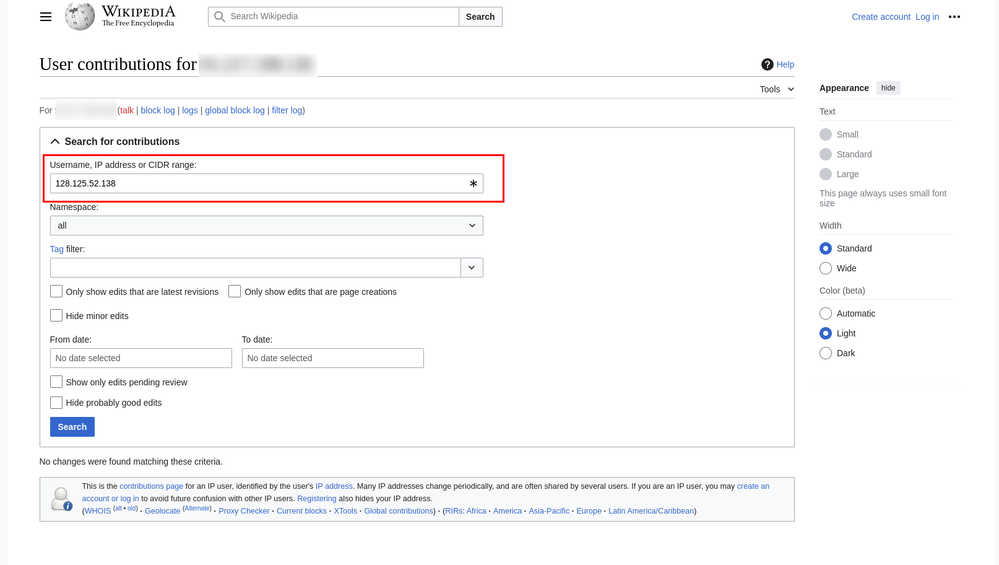

# Wikipedia          

`Wikipedia` is the largest and most popular general reference work on the internet, featuring millions of articles in multiple languages contributed by volunteers worldwide. Founded in 2001 by `Jimmy Wales` and `Larry Sanger`, it operates on a non-profit basis through the `Wikimedia Foundation`. Remarkably, `Wikipedia's` collaborative model allows anyone to edit most articles, promoting a unique and evolving repository of knowledge.

### Step-1: Go to Wikipedia

I will do this challenge on `English Wikipedia`.


https://en.wikipedia.org/wiki/Main_Page

### Step-2: Contributions

Click on the three dots near `Create account`. When the menu expands — click on `Contributions`.


### Step-3: Contributions - part II

Expand `Search for contributions` menu and paste below given `ip address` - `128.125.52.138`.



Press `Search`.


Then press `diff`.


Flag is here.

### Step-4: Paste The Flag

```
CTFlearn{cNi76bV2IVERlh97hp}
```