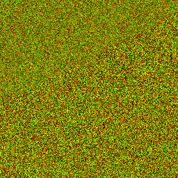
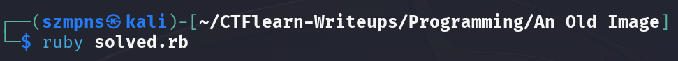
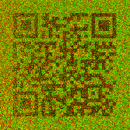

# An Old Image      

Author says:

I've been storing this image as a table for a very long time. The table has four columns – `x`, `y`, `red`, `green`. When I recreated the image from the table, the columns seemed to have gotten mixed up! Could you recreate the image?

### Step-1: Download the .png



[FILE](old_image.png)

### Step-2: Write a script

Mine is in `Ruby` but `Python` is a good language for that as well(`from PIL import Image`) and as I've tested it also - the Python generated image is even better.

```ruby
require 'chunky_png'

image = ChunkyPNG::Image.from_file('old_image.png')

for x in 0...image.height
    for y in 0...image.width
    pixel_value = image[x, y]
    new_x = ChunkyPNG::Color.r(pixel_value)
    new_y = ChunkyPNG::Color.g(pixel_value)
    
    new_color = ChunkyPNG::Color.rgb(x, y, 0)
    
    image[new_x, new_y] = new_color
    end
end

image.save('flag.png')

system('xdg-open flag.png')
```

Run it.



Scan the QR Code and Flag is there.



### Step-3: Paste The Flag

```
CTFlearn{how_can_swapping_columns_hide_a_qr_code}
```