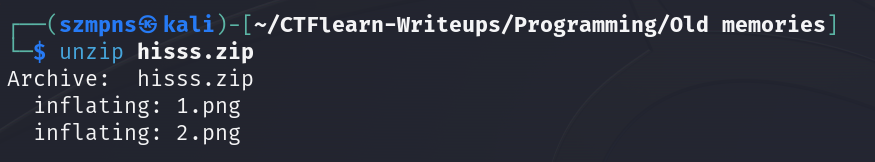
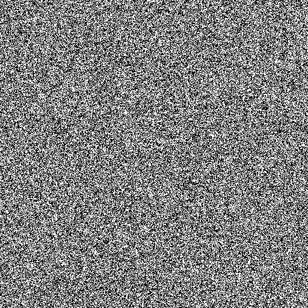
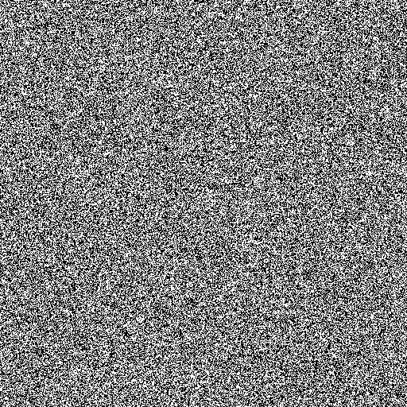
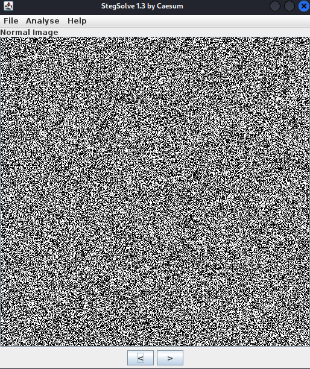
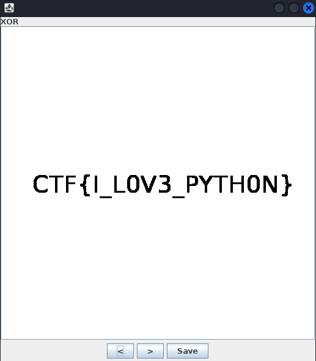
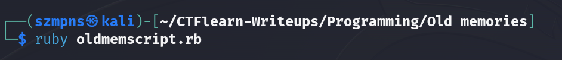
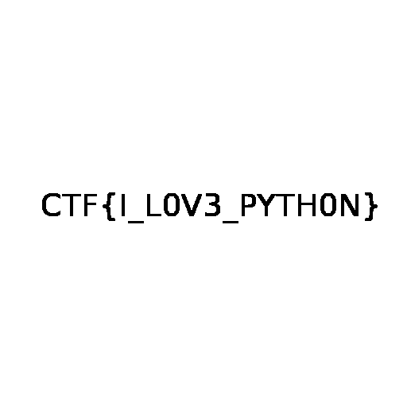

# Old memories      

### Step-1: Download the .zip

https://mega.nz/file/aHhhGAAB#QPWGYtUiW59R_DhE0-Dv7rAm8fqkW1YXmwLsAPZSOK8

### Step-2: Unzip

Let's unpack it.



We receive two `.png` files.

`1.png`



`2.png`



### Step-3: Stegsolve

Download stegsolve.

https://github.com/zardus/ctf-tools/blob/master/stegsolve/install

You can do that by simply just pasting two lines below when you are in your preferred directory.

```
1) wget http://www.caesum.com/handbook/Stegsolve.jar -O stegsolve.jar
2) chmod +x stegsolve.jar
```
Open it:

```
java -jar stegsolve.jar 
```

Now go to `File` -> `Open` and load the `1.png`.



Then go to `Analyse` -> `Image Combiner` and load `2.png`.



There is our flag.

As it is programming challenge, let's write a code to solve it in a different way.

### Step-4: Write a script

Mine is in `Ruby` but `Python` is a good language for that as well(`from PIL import Image`).

```ruby
require 'chunky_png'

image1 = ChunkyPNG::Image.from_file('1.png')
image2 = ChunkyPNG::Image.from_file('2.png')

if image1.height == image2.height && image1.width == image2.width
    image1.height.times do |i|
        image1.width.times do |j|
            if image1[i,j] == image2[i,j]
                image1[i,j] = ChunkyPNG::Color('black')
            else
                image1[i,j] = ChunkyPNG::Color('white')
            end
        end
    end
end

image1.save("flag.png")

system("xdg-open flag.png")
```

Run it.



Flag is there.



### Step-5: Paste The Flag

```
CTF{I_L0V3_PYTH0N}
```