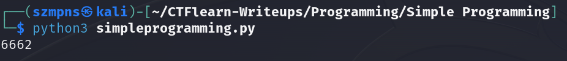

# Simple Programming  

Author says:

Can you help me? I need to know how many lines there are where the number of 0's is a multiple of 3 or the numbers of 1s is a multiple of 2. Please! Here is the file: https://mega.nz/#!7aoVEKhK!BAohJ0tfnP7bISIkbADK3qe1yNEkzjHXLKoJoKmqLys

### Step-1: Download the file

https://mega.nz/#!7aoVEKhK!BAohJ0tfnP7bISIkbADK3qe1yNEkzjHXLKoJoKmqLys

[FILE](data.dat)

### Step-2: Write a script

Mine is:

```
with open("data.dat" , "r") as file:
    data  = file.readlines()

    counter = 0

    for line in data:
        if line.count('0') % 3 == 0 or line.count('1') % 2 == 0:
            counter += 1

    print(counter)
```



### Step-3: Paste The Flag

```
6662
```
