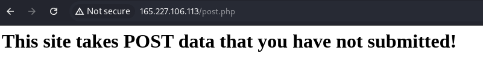
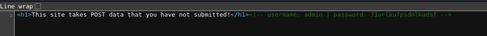
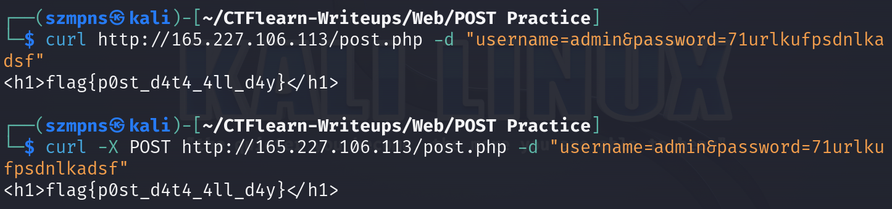

# POST Practice

In this task we want to send data via a POST request to retrieve a hidden flag.

### Step-1: Joining URL

After opening the URL http://165.227.106.113/post.php we can see:



### Step-2: Survey

There's not much we can do. Checking the page source gives us successive output:



```<!-- username: admin | password: 71urlkufpsdnlkadsf -->```

### Step-3: Curl

The most important thing is to use ```curl``` with option ```-d```

We should use one of the following commands.:



There is no need of using ```-X POST``` because the `-d` option automatically switches the method to POST.

Both options work correctly.

### Step-4: Paste The Flag

```
flag{p0st_d4t4_4ll_d4y}
```

